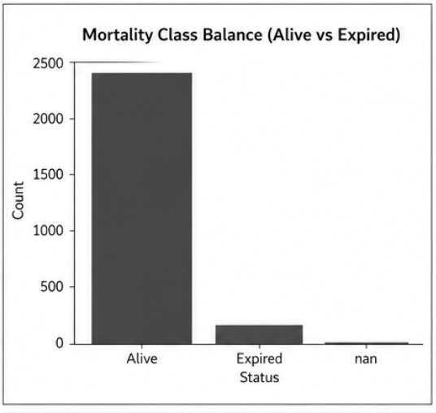
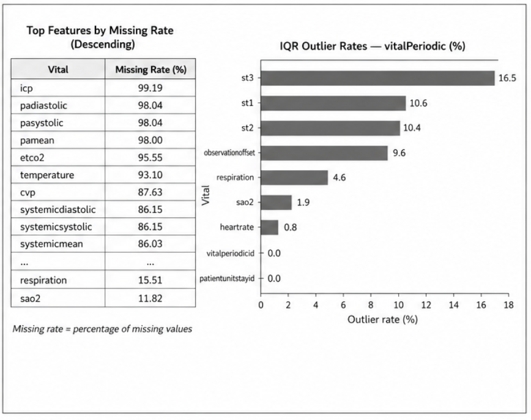
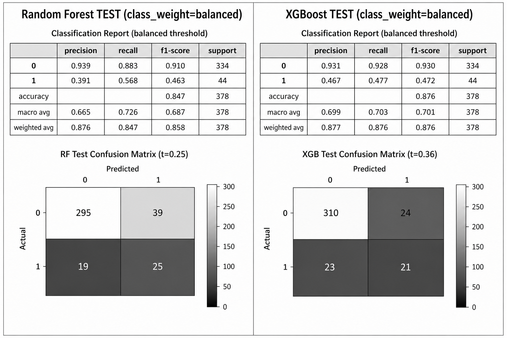
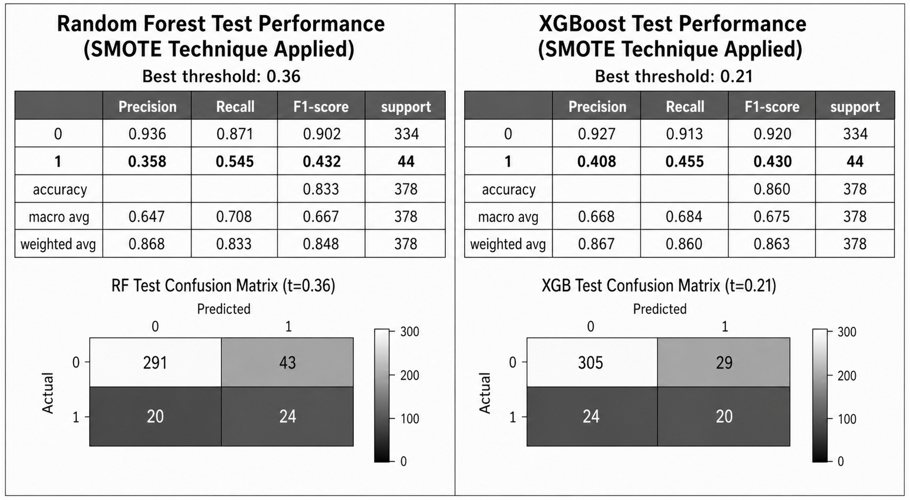
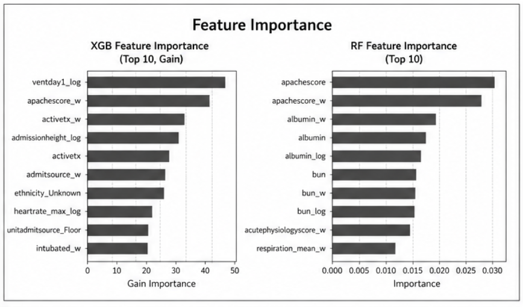

# **ICU OUTCOME PREDICTION IMBALANCE: CLASS IMBALANCE AND THRESHOLD OPTIMIZATION**
Darlene Eligado  
DATA 4381 Data Capstone Project 1  
University of Texas at Arlington  

## PROBLEM
- Intensive Care Units (ICUs) require early identification of high risk patients to improve outcomes and allocate resources effectively. However, ICU datasets are highly imbalanced, with most patients recovering and only a small portion experiencing critical outcomes such as death.
- This imbalance causes machine learning models to appear highly accurate while failing to detect the patients who need attention the most.
- The goal of this project is to improve detection of high risk ICU patients while analyzing trade-offs between model performance and real-world clinical usefulness.

## PROJECT OVERVIEW
This project focuses on **predicting poor ICU outcomes using machine learning**, with emphasis on:
- Class imbalance handling
- Threshold optimization
- Model comparison
- Performance trade-off analysis
**Key finding:** Optimizing model performance significantly changes how risk is interpreted, and higher evaluation metrics do not necessarily indicate better clinical usefulness.

## DATASET
**Source: eICU Collaborative Research Database Demo from PhysioNet**
Link: https://physionet.org/content/eicu-crd-demo/2.0.1/
- Approximately 2,520 ICU stays
- Includes demographic, clinical, and physiological data
- Uses first 24-hour aggregated vitals and lab values

### CLASS IMBALANCE

- Only a small proportion of patients experience poor outcomes, making prediction difficult and biasing models toward the majority class.

## DATA CHARACTERISTICS

- This visualization shows an example of the initial raw ICU dataset, including missingness and irregular measurements typical in clinical data.

## DATA PREPROCESSING
Performed in: `Objective3_Preprop.ipynb`
Key steps:
- Missing value handling and imputation
- Removal of unrealistic physiological values
- Aggregation of first 24-hour labs and vitals
- Encoding of categorical variables
- Reduction of multicollinearity

Final dataset used:
- `ICUop_prep.csv`

## MODELING APPROACH
Models used:
- Logistic Regression (initial baseline)
- Random Forest
- XGBoost

Imbalance strategies:
- Class weighting
- SMOTE synthetic minority oversampling

Threshold tuning:
- Evaluated thresholds from 0.01-0.99
- Selected based on F1-score and recall

## BASELINE PERFORMANCE

- The Logistic Regression baseline model struggles with minority class detection.

## RESULTS
Class-weight models:

SMOTE models:

### INTERACTIVE DASHBOARD
View the full analysis in Tableau: https://public.tableau.com/app/profile/darlene.eligado/viz/icu_17640085319390/Objective3

## KEY FINDINGS
- Threshold tuning had greater impact than model selection
- SMOTE increased recall but introduced more false positives
- Class weighting produced more stable and realistic results
- Random Forest showed higher sensitivity
- XGBoost produced more precise predictions

## MODEL INTERPRETATION

Important features:
- APACHE severity score
- Vital signs such as heart rate and oxygen saturation
- Lab values such as creatinine, BUN, and glucose

## TRADE-OFFS
- Increasing recall leads to more false positives
- SMOTE improves detection but reduces real-world realism
- Class weighting preserves realism but reduces sensitivity
- Lower thresholds increase alerts but reduce precision

## CONCLUSION
Imbalance handling changes how models interpret risk. In ICU prediction, maximizing performance metrics alone is insufficient. Models must balance sensitivity, precision, and realism to be useful in clinical decision making.

## FUTURE WORK
- Improve model's recall-precision balance
- Expand feature engineering
- Develop dashboard for real time use
- Evaluate fairness and bias
- Implement ensemble models

## DATA ACCESS
To reproduce the full pipeline:
1. Download the eICU Collaborative Research Database Demo from PhysioNet:  
   https://physionet.org/content/eicu-crd-demo/2.0.1/
2. Use the SQLite database file from PhysioNet.
3. Run the merging notebook:
   - `mergeICU_db.ipynb`
4. Run the Objective 3 preprocessing notebook:
   - `Objective3_Preprop.ipynb`

Alternatively, use the prepared dataset:
- `ICUop_prep.csv`

## HOW TO RUN
Install dependencies:
`pip install -r requirements.txt`
Steps:
1. Run preprocessing:
   - `Objective3_Preprop.ipynb`
2. Run modeling:
   - `icu_modeling_classweight.ipynb`
   - `icu_modeling_smote.ipynb`

## PROJECT STRUCTURE
- `notebooks/` : preprocessing and modeling workflows  
- `data/` : final dataset used for Objective 3 modeling  
- `data_processing/` : initial merging and feature construction  
- `images/` : visualizations used in this README  
- `results/` : final outputs and poster  
- `reports/` : written reports and project documentation  
- `presentations/` : proposal and progress presentation slides  

## REQUIREMENTS
- pandas
- numpy
- scikit-learn
- xgboost
- imbalanced-learn
- matplotlib
- jupyter

## REFERENCES
[1] Johnson, A., Pollard, T., Badawi, O., & Raffa, J. (2021). eICU Collaborative Research Database Demo (version 2.0.1). PhysioNet. https://doi.org/10.13026/4mxk-na84

[2] European Journal of Medical Research. (2022). Evaluation of mortality prediction using SOFA and APACHE IV in critically ill patients: A retrospective study. https://eurjmedres.biomedcentral.com/articles/10.1186/s40001-022-00822-9

[3] Meng, C., Trinh, L., Xu, N., Enouen, J., & Liu, Y. (2022). Interpretability and fairness evaluation of deep learning models on MIMIC-IV dataset. Scientific Reports, 12, Article 7166. https://doi.org/10.1038/s41598-022-11012-2

[4] Obermeyer, Z., Powers, B., Vogeli, C., & Mullainathan, S. (2019). Dissecting racial bias in an algorithm used to manage the health of populations. Science, 366(6464), 447–453. https://doi.org/10.1126/science.aax2342

[5] Shi, J., Hubbard, A. E., Fong, N., & Pirracchio, R. (2025). Implicit bias in ICU electronic health record data: Measurement frequencies and missing data rates of clinical variables. BMC Medical Informatics and Decision Making, 25, Article 241. https://doi.org/10.1186/s12911-025-03058-9

[6] Wang, H. E., Weiner, J. P., Saria, S., Lehmann, H., & Kharrazi, H. (2024). Assessing racial bias in healthcare predictive models: Practical lessons from an empirical evaluation of 30-day hospital readmission models. Journal of Biomedical Informatics, 156, 104683. https://doi.org/10.1016/j.jbi.2024.104683

[7] Wang, H. E., Weiner, J. P., Saria, S., & Kharrazi, H. (2024). Evaluating algorithmic bias in 30-day hospital readmission models: Retrospective analysis. Journal of Medical Internet Research, 26(1), Article e47125. https://doi.org/10.2196/47125

